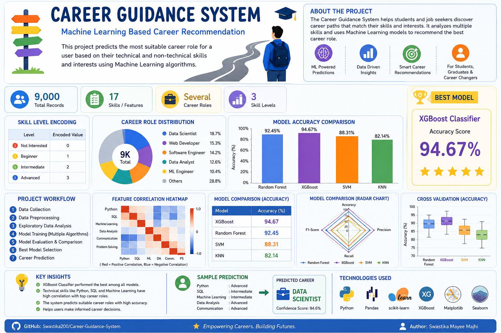

# AI Enhanced Career-Guidance-System
An AI based solution for guiding todays generation in choosing their future career.

<h2 align="center">Project Poster</h2>

  

## Overview

The Career Guidance System is a machine learning-based project designed to recommend suitable career paths based on a user's skills and interests. By analyzing various technical and non-technical skill levels, the system predicts the most appropriate career role using multiple classification algorithms and selects the best-performing model.

This project aims to help students, fresh graduates, and career changers make informed career decisions through data-driven recommendations.

## Features

Career prediction based on user skills and interests.

Data pre-processing and handling of missing values.

Multiple machine learning models for comparison:
    
    Random Forest Classifier
    
    XGBoost Classifier
    
    Support Vector Machine (SVM)
    
    K-Nearest Neighbors (KNN)
    
    Automatic selection of the best-performing model.

Data visualization for:
  
  Career role distribution
  
  Feature correlation heatmap
  
  Model accuracy comparison
  
  Performance heatmap
  
  Radar chart
  
  Box plot analysis

## Dataset

The project uses a dataset (dataset9000.csv) containing information about:

Skill levels (Beginner, Intermediate, Advanced)

User interests

Career roles

## Technologies Used

Python

Pandas

NumPy

Scikit-learn

XGBoost

Matplotlib

Seaborn

Jupyter Notebook

## Results

The project compares multiple machine learning models and identifies the best-performing classifier based on accuracy. This helps ensure reliable career recommendations for users.

